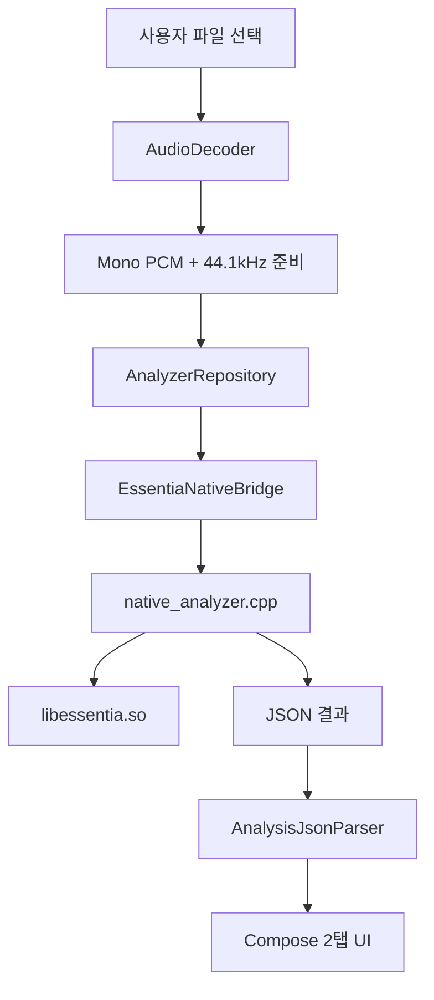

# Essentia Android Maker


Essentia 기반 음악 분석 Android 앱 프로젝트입니다.  
이 저장소는 "원본 Essentia 소스"와 "Android 앱 프로젝트"를 함께 포함합니다.

## 목차

- [프로젝트 개요](#프로젝트-개요)
- [저장소 구조 분석](#저장소-구조-분석)
- [아키텍처](#아키텍처)
- [요구 환경](#요구-환경)
- [빠른 시작 (Windows, CLI)](#빠른-시작-windows-cli)
- [Android Studio 빌드/실행](#android-studio-빌드실행)
- [Essentia 네이티브 라이브러리 재빌드](#essentia-네이티브-라이브러리-재빌드)
- [현재 앱 UI/기능](#현재-앱-ui기능)
- [트러블슈팅](#트러블슈팅)
- [검증 체크리스트](#검증-체크리스트)

## 프로젝트 개요

- 앱 모듈: `essentia_android_app/app`
- 패키지명: `com.iriver.essentiaanalyzer`
- 분석 입력: Android `MediaCodec/MediaExtractor` 디코딩 결과(Float mono)
- 분석 엔진: JNI(`libaudioanalyzer_jni.so`) + Essentia(`libessentia.so`)
- 현재 ABI: `arm64-v8a` 전용
- 최대 분석 길이: 15분 (`MAX_DURATION_SECONDS = 900`)

## 저장소 구조 분석

| 경로 | 역할 |
|---|---|
| `essentia/` | Essentia 원본 소스(업스트림 성격) |
| `essentia_android_app/` | Android 앱 + Essentia 빌드/패키징 스크립트 |
| `essentia_android_app/app/` | 실제 APK를 만드는 Android 앱 모듈 |
| `essentia_android_app/app/src/main/cpp/native_analyzer.cpp` | JNI 분석 핵심 구현 |
| `essentia_android_app/app/src/main/java/...` | Compose UI, ViewModel, 디코딩/리포지토리 계층 |
| `essentia_android_app/build_android.sh` | Essentia Android 네이티브 라이브러리 빌드 |
| `essentia_android_app/scripts/sync_essentia_artifacts.sh` | 빌드된 Essentia 산출물을 앱 모듈로 동기화 |

핵심 포인트:
- 앱 개발/빌드 기준 루트는 `essentia_android_app` 입니다.
- 루트의 `essentia/`는 앱 직접 빌드 입력이라기보다 원본 소스 보관/참조 용도입니다.

## 아키텍처



레이어 요약:
- UI: `MainActivity.kt` (2탭: 파일 선택/정보, 분석/상세 내역)
- State: `AnalyzerViewModel.kt`
- Data: `AnalyzerRepository.kt`, `AudioDecoder.kt`, `LinearResampler.kt`
- Native Bridge: `EssentiaNativeBridge.kt`
- Native Core: `native_analyzer.cpp`

## 요구 환경

### 필수

1. Android Studio (JBR 17 포함 버전 권장)
2. Android SDK
3. Android SDK Platform `36`
4. Android NDK `26.1.10909125`
5. CMake `3.22.1`
6. USB 디버깅 가능한 Android 기기 (`arm64-v8a`)

### 프로젝트 설정값(현재)

- AGP: `8.5.2`
- Kotlin: `1.9.24`
- Gradle Wrapper: `8.7`
- `compileSdk`: `36`
- `targetSdk`: `36`
- `minSdk`: `24`
- Java/Kotlin target: `17`

## 빠른 시작 (Windows, CLI)

아래 절차는 PowerShell 기준입니다.

### 1) 작업 경로 이동

```powershell
cd D:\project_new\essentia_android_maker\essentia_android_app
```

### 2) SDK 경로 확인

`local.properties` 예시:

```properties
sdk.dir=D\:\\Android\\Sdk
```

파일이 없다면 생성합니다.

### 3) Gradle JDK 경로 확인

`gradle.properties`에 아래 항목이 현재 하드코딩되어 있습니다.

```properties
org.gradle.java.home=C:/Program Files/Android/Android Studio/jbr
```

로컬 환경 경로가 다르면 반드시 수정해야 합니다.

### 4) JNI 필수 라이브러리 확인

아래 파일이 존재해야 앱이 실행됩니다.

- `app/src/main/jniLibs/arm64-v8a/libessentia.so`
- `app/src/main/jniLibs/arm64-v8a/libc++_shared.so`

### 5) 디버그 빌드

```powershell
.\gradlew.bat :app:assembleDebug
```

APK 산출물:

- `app/build/outputs/apk/debug/app-debug.apk`

### 6) 기기 연결 확인

```powershell
adb devices
```

`device` 상태로 표시되어야 설치 가능합니다.

### 7) APK 설치

```powershell
.\gradlew.bat :app:installDebug
```

### 8) 앱 실행

```powershell
adb shell am start -n com.iriver.essentiaanalyzer/.MainActivity
```

### 9) 로그 확인(권장)

```powershell
adb logcat -c
adb logcat | Select-String "Essentia|audioanalyzer_jni|AndroidRuntime|Fatal"
```

## Android Studio 빌드/실행

1. Android Studio에서 `essentia_android_app` 폴더를 Open
2. Gradle Sync 완료 확인
3. SDK/NDK/CMake 자동 인식 확인
4. Run Configuration에서 `app` 선택
5. 연결된 `arm64` 디바이스 선택 후 Run

## Essentia 네이티브 라이브러리 재빌드

`libessentia.so`를 새로 빌드해 앱에 반영하려는 경우 절차입니다.

주의:
- `build_android.sh`는 Bash 기반이라 Windows에서는 WSL2 또는 Git Bash 환경 권장
- `python3`, `pkg-config`, `eigen3` 준비 필요

### 1) Essentia Android 아티팩트 빌드

```bash
cd essentia_android_app
export ANDROID_NDK_ROOT=/path/to/android/ndk/26.1.10909125
bash ./build_android.sh --abi arm64-v8a --package
```

성공 시 `android-package/`에 산출물 생성:
- `android-package/jniLibs/arm64-v8a/libessentia.so`
- `android-package/include/essentia/...`

### 2) 앱 모듈로 동기화

```bash
cd essentia_android_app
ESSENTIA_PACKAGE_DIR="$PWD/android-package" \
EIGEN_INCLUDE_DIR=/path/to/eigen3 \
bash ./scripts/sync_essentia_artifacts.sh
```

### 3) 앱 재빌드

```powershell
cd D:\project_new\essentia_android_maker\essentia_android_app
.\gradlew.bat :app:assembleDebug
```

## 현재 앱 UI/기능

### 탭 구성 (2탭)

1. 파일 선택/정보
- 파일 선택 버튼
- 파일 메타: 파일명, MIME, 파일 크기
- 오디오 정보: 재생 길이, 샘플레이트, 채널
- 네이티브 준비 상태/최근 오류

2. 분석/상세 내역
- 분석 시작 버튼
- 디코딩/분석 진행 상태
- 상세 결과 섹션: `Summary`, `Meta`, `Temporal`, `Spectral`, `Rhythm`, `Tonal`, `Highlevel`, `Stats`, `Charts`
- `Errors`는 치명적 오류만 노출

### 안정성 업데이트

- 네이티브 `downsampleEnvelope()` 인덱스 계산을 `size_t` 기반으로 보정
- 범위 클램프 및 경계 방어 코드 반영
- 기존 `int` 곱셈 오버플로우 기반 `SIGSEGV` 리셋 경로 완화

## 트러블슈팅

### 1) SDK 위치 오류

증상:
- `SDK location not found`

조치:
- `local.properties`에 `sdk.dir` 정확히 설정

### 2) JDK 불일치

증상:
- Gradle/JVM 관련 빌드 실패

조치:
- `gradle.properties`의 `org.gradle.java.home`를 실제 JDK17 경로로 수정

### 3) NDK/CMake 미설치

증상:
- CMake configure 실패, native build 실패

조치:
- SDK Manager에서 NDK `26.1.10909125`, CMake `3.22.1` 설치

### 4) `libc++_shared.so` 누락

증상:
- 앱 시작 직후 네이티브 로딩 실패

조치:
- `app/src/main/jniLibs/arm64-v8a/libc++_shared.so` 존재 확인
- 필요 시 NDK sysroot에서 동일 ABI 파일 복사

### 5) ABI 불일치

증상:
- 설치/실행 실패 또는 `INSTALL_FAILED_NO_MATCHING_ABIS`

조치:
- 현재 빌드는 `arm64-v8a` 전용
- 기기 ABI를 `adb shell getprop ro.product.cpu.abi`로 확인

### 6) `compileSdk 36` 관련 경고

증상:
- AGP 경고 발생 가능

조치:
- 현재 프로젝트는 `android.suppressUnsupportedCompileSdk=36` 설정 포함
- 가능하면 최신 Android Studio/SDK로 맞추는 것을 권장

## 검증 체크리스트

- [ ] `:app:assembleDebug` 성공
- [ ] `:app:installDebug` 성공
- [ ] 앱 실행 후 상단 앱바 없이 2탭 UI 노출
- [ ] 파일 선택 탭에서 메타+오디오 정보 표시
- [ ] 분석 탭에서 진행 상태 및 상세 결과 표시
- [ ] 장시간(최대 15분) 분석 시 앱 리셋/SIGSEGV 재발 없음

## 최근 빌드 검증

- 기준 일시: 2026-02-25
- 실행 명령: `.\gradlew.bat :app:assembleDebug`
- 결과: `BUILD SUCCESSFUL`

---

필요하면 다음 단계로 `README`에 스크린샷 섹션, 릴리즈 서명/배포 절차, CI 파이프라인(`assembleDebug` 자동화)까지 확장할 수 있습니다.
